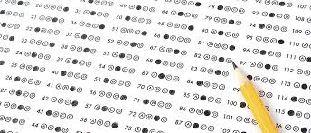

# PyCity Schools: School District Analysis 

## Overview
Maria, the Chief Data Scientist for PyCity School District, has requested my help analyzing data on student funding and student's standardized test scores. The task is to aggregate the student data and showcase trends in performance to assist the School Board and Superintendent in making decisions regarding school budgets and priorities. 

Maria was notified by the school board that the analysis we initially completed shows evidence of academic dishonesty; specifically, reading and math grades for Thomas High School ninth graders appear to have been altered. Although the school board does not know the full extent of the academic dishonesty, they want to uphold state-testing standards and have turned to Maria for help. She has asked me to replace the math and reading scores for Thomas High School with NaNs while keeping the rest of the data intact. After I replaced the math and reading scores, I repeated the school district analysis and a m now prepared to present this written report that will describe how these changes affected the overall analysis. 

The purpose of this analysis is to find the overall passing percentages of the students and see if there is any correlation with the budget per student. 

## Results
The PyCity district summary was affected by removing the ninth grade student scores in math and reading. In the pictures below you will see that the 

 

After taking a look at both district summaries from pycityschools and pycityschools_challenge there is not a change.

#How is the school summary affected?

The over all passing for Thomas High School was 90.94% in pycityschools, with the 9th graders taken out the overall passing shrinks by 0.3 %.

#How does replacing the ninth graders’ math and reading scores affect Thomas High School’s performance relative to the other schools?

Overall it does not affect either the reading scores or math scores. We are doing an investigation because we believe they are not including most of the 9th graders scores because they might bring the school even further down in test scores.

#How does replacing the ninth-grade scores affect the following: #Math and reading scores by grade

The only difference now between the scores is that under 9th graders who attended Thomas High School it shows an NaN.

#Scores by school spending

The numbers stay nearly identical since the 9th graders are nullified from the statistics.

#Scores by school size

Overall passing percentage does not change.

#Scores by school type

Scores by school type are not altered at all.

# Summary

After we have replaced the scores of the 9th grade students we learn that not much has changed. We have nullified the values that we felt would alter size,district, spending and overall passing percentage of the students.

______________________________________________________________________________

The analysis should contain the following:

Overview of the school district analysis: Explain the purpose of this analysis.

Results: Using bulleted lists and images of DataFrames as support, address the following questions.

How is the district summary affected?
How is the school summary affected?
How does replacing the ninth graders’ math and reading scores affect Thomas High School’s performance relative to the other schools?
How does replacing the ninth-grade scores affect the following:
Math and reading scores by grade
Scores by school spending
Scores by school size
Scores by school type
Summary: Summarize four major changes in the updated school district analysis after reading and math scores for the ninth grade at Thomas High School have been replaced with NaNs.
_____________________________________________________________________________________________________________________________

PyCity Schools Data Summary
As a whole, schools with higher budgets, did not yield better test results. By contrast, schools with higher spending per student actually ($645-675) underperformed compared to schools with smaller budgets (<$585 per student).

As a whole, smaller and medium sized schools dramatically out-performed large sized schools on passing math performances (89-91% passing vs 67%).

As a whole, charter schools out-performed the public district schools across all metrics. However, more analysis will be required to glean if the effect is due to school practices or the fact that charter schools tend to serve smaller student populations per school.

__________________________________________________________________________________________________________________________________________

Schools that spend between 585-615 dollars per student have a better percent passing reading, percent passing math, and percent overall passing rate than schools that spend more than 615 dollars per student. Also, those schools that spend less per student are smaller schools with 2,000 students or less.
It is also found that the schools with 2000 students or less have a higher percent passing reading, percent passing math, and percent overall passing rate than larger schools that have 2000 – 5000 students. Furthermore, the smaller the school, the less they spend per student.
With that being said,Charter schools have a higher percent passing reading, percent passing math, and percent overall passing rate than District schools. Thus being the top five performing schools based on percent passing rates, whereas the bottom five performing schools based on percent passing rate are District schools.
In all 15 schools, the Average Reading Score is higher than the Average Math Score.
Lasly, for the top 5 performing schools, the percent passing math is about 20 percent lower than the percent passing reading.

_________________________________________________________________________________________________________________________________________

Two clear trends appear in the data:

Charter schools performed better than district schools. The average charter math and reading scores showed a respective 5 point and 3 point edge over the district schools, resulting in a math passing rate over 25 percentage points higher, and a reading passing rate over 15 points higher.
Smaller schools--measured by total students, total budget, or, most surprisingly, budget per student--had better math and reading test scores than larger schools. In each size analysis, the bottom two quintiles' schools' test scores were over 5 points better in math, and over 3 points better in reading than the larger schools. This translated into passing rates for math and reading 20 and 10 percentage points higher, respectively, in the two smallest-quintile schools.
One complicating wrinkle is that the charter schools are all smaller. Wilson High, the largest charter school, serves almost 500 fewer students than Ford High, the smallest district school.

One argument against directly attributing better scores to school size: the charter schools' better scores do not vary by school size. The district schools' scores vary little by school size as well.

The next challenge is to determine whether there is a systematic difference in the composition of the charter school student population versus the district school student population.

Two observations:

Squashing the SettingWithCopyWarning issue was tricky. I most benefited from
This explanation and
the suggestion to use df.copy().
It's frustrating that some Jupyter Notebook tables don't display correctly in GitHub.
